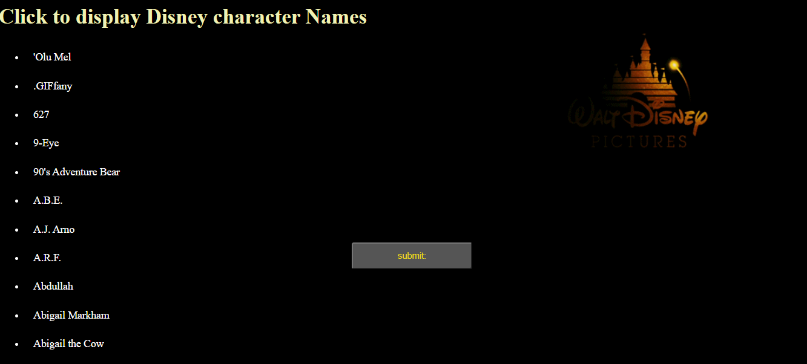

# 📊 Project:Simple API 2

### Goal: Display data returned from an api

Build an application that allows users to input a date and view Disney characters
**Link to project: https://ddsimpleapitwo.netlify.app/ 

###  My Simple API Project
This project highlights my use of HTML, CSS and javaScript; a nostalgic list of data displaying characters names from Disney Channel.

## How It's Made:

**Tech used:** HTML, CSS, JavaScript

I utilized my skills in javaScript, HTML and CSS to include the use of API's paramteres into my functions and printing the results (depending on users choices)to the document.
## Lessons Learned:
I learned how to utlize a ul in the dom to append an li which was later used to display the API data.